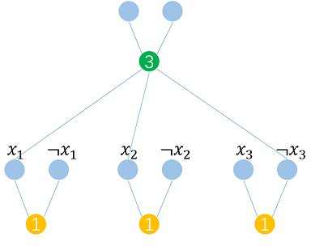
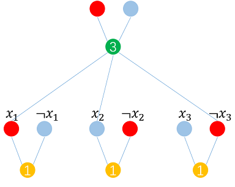
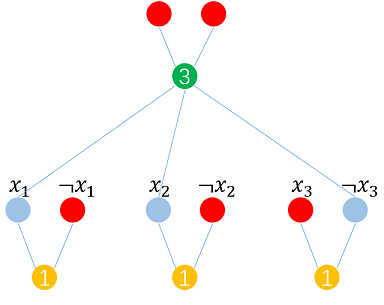
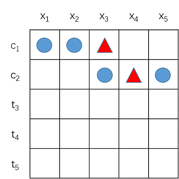
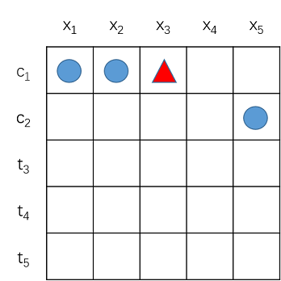
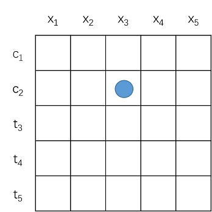
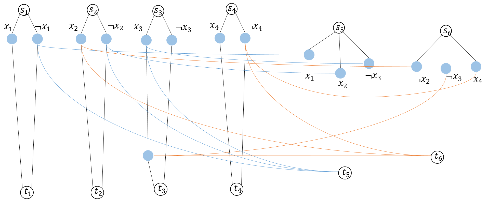
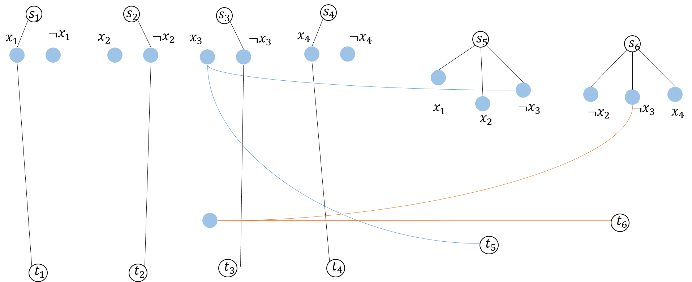
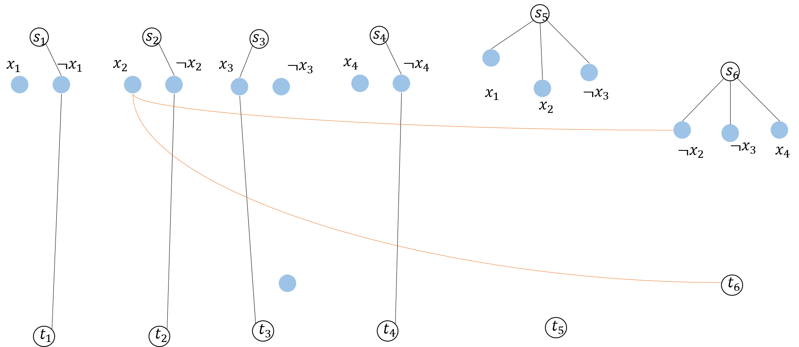

# 计算机算法设计与分析-作业6(NP)

- Author: hrwhipser
- https://github.com/hrwhisper/algorithm_course/

## 1. Integer Programming

> Given an integer $ m \times n $ matrix A and an integer m-vector b, the Integer programming problem asks whether there is an integer n-vector x such that $Ax \ge b$. Prove that Integer-programming is in NP-complete.

首先，给定矩阵A和向量b，以及向量x，显然可以在多项式时间内验证$Ax \ge b$, 所以Integer Programming 是NP问题。

要证明Integer Programming 是NP完全问题，我们只需证明 $3SAT \leq_p Integer Programming$ 问题即可。

为此，我们进行如下的构造：

对于$ p \vee q\vee r $问题，我们只需要转化为 $x_1 + x_2  + x_3 \geq 1$ 即可。

对于有$\neg$符号的如 $ p \vee \neg q\vee \neg r $，转化为 $x_1 + (1 - x_2)  + (1 - x_3) \geq 1$ 即 $x_1 - x_2  - x_3 \geq -1$ 

若p=1,则$x_1 = 1$，否则$x_1 = 0$.

因此，对于3SAT问题中的n个子句，我们均可以转成相应的不等式。而不等式组又可以写成相应的矩阵形式（类似线性规划）。3SAT问题有解说明每个子句都为真，在Integer Programming中就是各个不等式均成立。3SAT无解同时也说明Integer Programming中有等式不能满足约束。

因此$3SAT \leq_p Integer Programming$ ，所以Integer Programming是整数规划问题。

## 2. Mine-sweeper

> This problem is inspired by the single-player game Mine-sweeper, generalized to an arbitrary graph. Let G be an undirected graph, where each node either contains a single, hidden mine or is empty. The player chooses nodes, one by one. If the player chooses a node containing a mine, the player loses. If the player chooses an empty node, the player learns the number of neighboring nodes containing mines. (A neighboring node is one connected to the chosen node by an edge.). The player wins if and when all empty nodes have been so chosen.
>
> In the **mine consistency problem**, you are given a graph G, along with numbers labeling some of G's nodes. You must determine whether a placement of mines on the remaining nodes is possible, so that any node v that is labeled m has exactly m neighboring nodes containing mines. Formulate this problem as a language and show that it is NP-complete.

mine consistency problem = { \<G,φ> |给定图G以及部分周围地雷个数的标注φ，求是否存在一种放置方式，使得对于任意标注为m的结点v，其相邻的结点的地雷个数为m个}

首先，给定图G以及地雷个数φ以及地雷的放置位置，我们只需要验证标注相邻结点有m个地雷的结点其地雷数是否真的为m个，显然可以在多项式时间内完成，所以mine consistency problem是NP问题。

要证明mine consistency problem 是NP完全问题，我们只需证明 $3SAT \leq_p$ mine consistency problem问题即可。

以$ x_1 \vee x_2 \vee \neg x_3 $ 为例，对于3SAT的子句我们可以构造如下图：

最下方黄色的1表示$ x_i $和$\neg x_i$只能有一个为真。若$ x_i $处为地雷，那么$ x_i  = 1$，否则$ \neg x_i  = 1$。我们将为真的点涂成红色。

若3SAT是可满足的，那么我们一定能让绿色的结点周围有且仅有3个红色的点，就是3个地雷，因为与绿色点相邻的每个变量至少有一个为真，而自己又连接了两个。以$x_1 = T,x_2 = F,x_3 = F$ 为例，有如下图：

若3SAT的赋值为假，那么无法使得绿色结点有3个红色的点，以$x_1 = F,x_2 = F,x_3 = T$ 为例，结果如下图

因此 $3SAT \leq_p mine\quad consistency \quad problem$ ，所以mine consistency problem是NP完全问题。

## 3. Half-3SAT

> In the Half-3SAT problem, we are given a 3SAT formula  with n variables and m clauses, where m is even. We wish to determine whether there exists an assignment to the variables of  such that exactly half the clauses evaluate to false and exactly half the clauses evaluate to true. Prove that Half-3SA problem is in NP-complete.

首先，给定一个有m个子句的 Half-3SAT问题以及n个变量的赋值，显然，我们可以在多项式时间内判断其是否是可满足的，即是否有$\frac{m}{2}$个子句为真，$\frac{m}{2}$个子句为假，因此， Half-3SAT可以在多项式时间验证，它是NP问题。

为了证明Half-3SAT是NP完全问题，我们只需要证明 $3SAT \leq_p Half-3SAT$ 问题即可。

我们假设3SAT问题$\phi$有n个变量，m个子句。

对于 Half-3SAT问题$\phi^{'}$，我们构造如下的子句

| 编号   | 个数   | 构造的子句                  |
| :--- | ---- | ---------------------- |
| 1    | m    | 同3SAT的所有子句             |
| 2    | m    | $ p \vee\neg p\vee q $ |
| 3    | 2m   | $ p \vee q\vee x $     |

可以看到第2种构造的m个子句$ p \vee\neg p\vee q $ 是永真式，而第3个有2m个同真同假的式子$ p \vee q\vee x $

对于3SAT，若其条件为真，那么说明编号1的m个子句为真，而另外的编号为2的式子也为真，一共有2m个为真的式子，接着，我们让编号3的2m个式子为假，只要让p和q和x均为假即可，那么显然，3SAT的有解那么Half-3SAT也有解。

若3SAT无解，那么在Half-3SAT中，为真的子句必然不等于2m（设编号1为真的子句有x个（x\<m）编号2的子句有m个，编号3的有2m个，若编号3为真，那么共有3m+x 个\> 2m, 若编号3为假，那么共有m+x < 2m个），Half-3SAT也无解。也就是说，当Half-3SAT有解时，有2m个式子为真，这2m个式子必然是编号1和编号2产生的。

因此有$3SAT \leq_p Half-3SAT$  ，所以Half-3SAT是NP完全问题。

## 4. Solitaire Game

> In the following solitaire game, you are given an n x n board. On each of its n^2^ positions lies either a blue stone, a red stone, or nothing at all. You play by removing stones from the board so that each **column** contains **only stones of a single color** and each **row** contains **at least one stone**. You win if you achieve this objective.
>
> Winning may or may not be possible, depending upon the initial configuration. You must determine the given initial conguration is a winnable game configuration. Let **SOLITAIRE** = { \<G> |G is a winnable game configuration}. Prove that SOLITAIRE is NP-complete.

首先，给定最终板子上的红色和蓝色石头的分布情况，我们只需要对每一列扫描，看其每一列是否颜色单一，然后对每一行扫描，看其每一行是否至少有一个石头。这只需要花费O(n^2^)的时间，因此Solitaire Game是NP问题。

为了证明Solitaire Game是NP完全问题，我们只需要证明 $3SAT \leq_p Solitaire\quad Game$ 问题即可。

对于一个3SAT问题，假设有N个变量，M个子句，若 $N \ne M$：

- N > M: 那么创建N - M个子句 $p \lor \neg p \lor q$的子句，这些子句不会对3SAT解照成影响。
- N < M: 那么创建M - N个不会被使用的变量。

接着我们设我们设n = max(M,N)，创建$n \times n$的板子。

我们将每一行对应一个子句，每一列对应一个变量。对于子句中$x_i$的变量，我们用蓝色圆形石头表示，对于子句中$\neg x_i$的变量，我们用红色三角形的石头表示。

因此，比如$ (x_1 \lor x_2 \lor\neg x_3)  \land  (x_3 \lor \neg x_4 \lor x_5) $ 如下图：

若变量$x_i$为True，我们移除红色三角形石头，否则，移除蓝色圆形石头。

以$x_1 = True ,x_2 = True ,x_3 = False,x_4=True,x_5 =True $ 如下图所示

这个赋值在SAT是为真的，而我们的Solitaire Game同样可以为真，在下面的$t_3 , t_4,t_5$ 中，只需要保证每一行都有一个石头，该石头与该列赋值一致即可（如$x_1 = True$那么放置蓝色石头，$x_3 = False$放置红色石头）。

而3SAT赋值为假的情况又如何呢？$x_1 = False,x_2 = False,x_3 = True,x_4=True,x_5 =False$为使得$ (x_1 \lor x_2 \lor\neg x_3)  \land  (x_3 \lor \neg x_4 \lor x_5) $ 为假的一组赋值。移除对应的石头有：

而无论下面的$t_3 , t_4,t_5​$ 如何赋值，第一行都是空的，不符合条件，Solitaire Game无解。

其实上述的移除石头的过程原理是：**用列来保证只有一种颜色**（要么赋值为真-蓝色，要么赋值为假-红色），而**用行来保证每行至少有一个石头**（该变量为真石头得到保留）。

因此有$3SAT \leq_p Solitaire\quad Game$  ，所以Solitaire Game是NP完全问题。

## 5. Directed Disjoint Paths Problem

> The Directed Disjoint Paths Problem is dened as follows. We are given a directed graph G and k pairs of nodes (s~1~, t~1~), (s~2~, t~2~), ... , (s~k~, t~k~). The problem is to decide whether there exist node-disjoint paths P~1~,P~2~,...., P~k~ so that Pi goes from si to ti. In details, the node-disjoint paths means that P~i~ and P~j~ ($1\le i \le k , 1\le j\le k, i \ne j $) share no nodes.
>
> Show that **Directed Disjoint Paths** is NP-complete.

首先，给定K条路径，我们可以在多项式的时间内判断每条路径是否没有共用结点，只需要记录遍历过的结点，然后每次查看当前结点是否被遍历了即可，所以是NP问题。

为了证明Directed Disjoint Paths Problem是NP完全问题，我们只需要证明 $3SAT \leq_p$Directed Disjoint Paths Problem 问题即可。

对于一个3SAT问题，我们构造k = n + m个源点s和终点t，其中n为变量的个数，m为子句的个数。

我们按如下的方式构造图：

- 构造n个源点编号为$s_1 - s_n$ ，以及n个终点编号为$t_1 - t_n$ ，然后对于每一个变量，构造a个$x_i$和b个$\neg x_i$ 变量，a为各个子句中$\neg x_i$的个数，b为各个子句中$x_i$的个数。把a个$x_i$与$x_i$变量连接，把b个变量$\neg x_i$和$\neg x_i$ 连接，然后用$s_i$连接第一个$x_i$和第一个$\neg x_i$结点，然后用最后一个$x_i$和最后个$\neg x_i$结点连接向$t_i$
- 构造m个源点编号为$s_{n+1} - s_{n+m}$ ，以及m个终点编号为$t_ {n+1}- t_{n+m}$ ,对于每一个子句，用一个源点s连向每个子句中的三个变量，这三个变量在连接到之前$s_1 - s_n$ 连接的相反的变量中。以$\neg x_2 \lor \neg x_3 \lor x_4$为例，连接到$x_2,x_3,\neg x_4$。若有多个使用同一个的变量，则要连接到不同的结点上。

构造图之后，路径的找法为：若$x_i$ （1 <= i <= n）为真，那么$s_i$走为真(经过$x_i$)的那条路径到$t_i$，否则走为假（经过$\neg x_i$）的路径。这样的原理是，若变量$x_i$为真，那么走为真的路径的话，可以把为假的路径让出来给子句中的$x_i$变量。

以$(x_1 \lor x_2 \lor \neg x_3) \land(\neg x_2 \lor \neg x_3 \lor x_4) $为例，我们构造如下的图：

现在我们证明若3SAT有解，那么Directed Disjoint Paths Problem 可以有K条不共享结点的路径。

以$x_1 = True,x_2 = False,x_3 = False,x_4=True$为例，$(x_1 \lor x_2 \lor \neg x_3) \land(\neg x_2 \lor \neg x_3 \lor x_4) $为真，我们可以找出下面6条不共享结点的路径。

若3AST结果为假，如$x_1 = False,x_2 = False,x_3 = True,x_4=False$为例，按照上面的找法我们不能找到6条不共享结点的路径。

因此有 $3SAT \leq_p$Directed Disjoint Paths Problem ，所以Directed Disjoint Paths Problem 是NP完全问题。

## 6. SIP problem

> The set intersection problem (SIP) is dened as follows: Given finite sets $A_1,A_2,....A_r$,$B_1,B_2,...B_s$ is there a set T such that
> $$
> | T \cap  A_i | \ge 1  \quad for \quad i=1,2,....,r
> $$
> and
> $$
> | T \cap  B_i | \le 1  \quad for \quad i=1,2,....,s
> $$
> Prove that the SIP is NP-complete.

首先给定集合T, A~i~ ,B~i~， 很容易判断T和各个A~i~, B~i~的交集数是否满足条件，因此SIP问题是NP问题。

为了证明SIP problem是NP完全问题，我们只需要证明 $3SAT \leq_p$SIP problem 问题即可。

对于一个3SAT问题有n个变量m个子句，我们构造A~i~为其各个子句，则共有m个。构造B为空集，T为$\{T_1,T_2.......T_n\}$ , 若3SAT变量$x_i = True$，那么$T_i= x_i$，否则$T_i= \neg x_i$。

显然3SAT有解SIP也有解，3SAT无解，SIP也无解。

